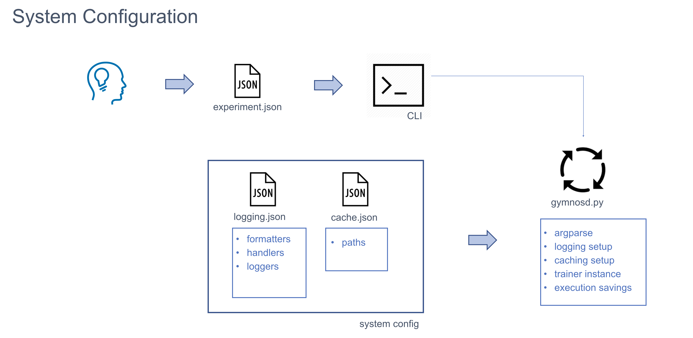
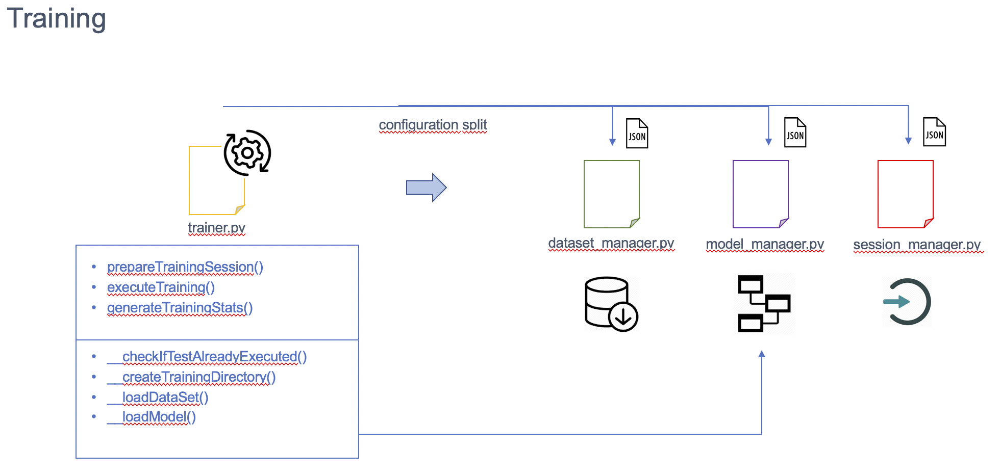
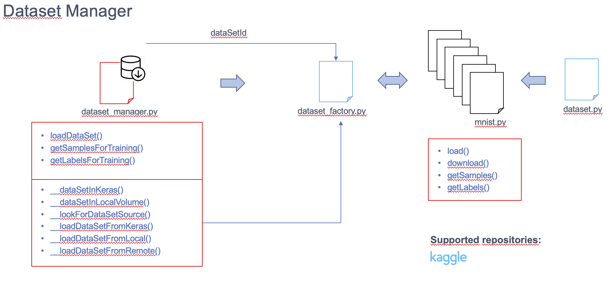
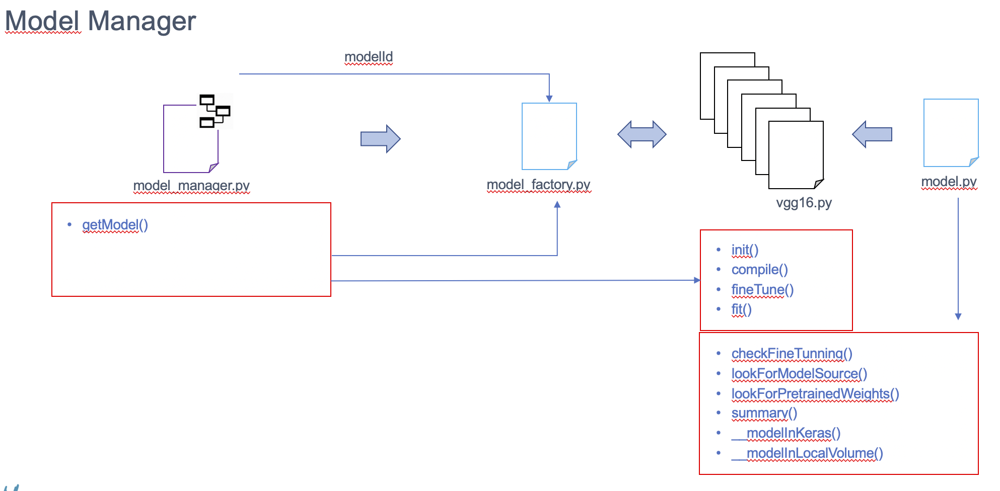
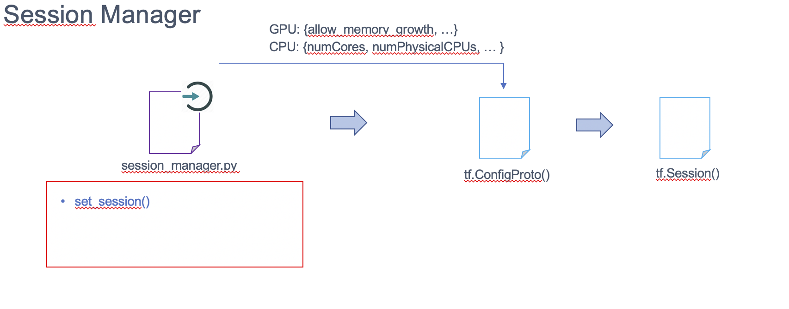
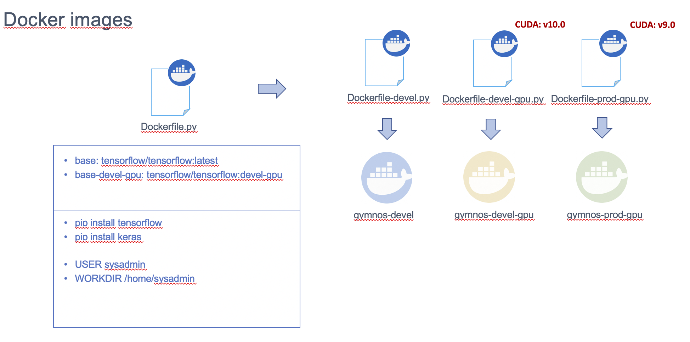
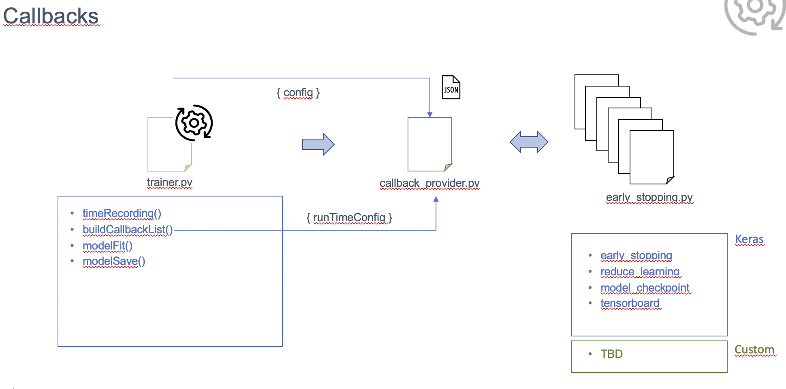

######################
Gymnos Architecture
######################

***********************
System Configuration
***********************
Gymnos runs in a single process ``gymnosd.py``. This process is responsible for:

* Setting up logging facilities
* Handling argument parsing
* Owning the trainer instance

Apart from that, there two important files holding the system settings:

* ``system.json`` : system paths, environmental variables, ...
* ``logging.json``: settings for logging facility

***********************
Training
***********************
The training phase is fully controlled by ``trainer.py``. 
The ``Trainer()`` class is responsible for orchestrating any aspect related to the training such as:

* To split experiment configurations into relevant pieces and deliver them to the related entities
* To prepare the system for the training process:
   * To collect a suitable dataset for the experiment purpose via ``DatasetManager()`` class
   * To load an optimized version of the requested model via ``ModelManager()`` class
   * To accomodate the training session to the underlying execution environment via ``SessionManager()`` class
* To run and monitor the training phase
* To inject any dependency via callbacks to produce richer training outcomes ``CallbackProvider()`` class
* To generate relevant artifacts for tracking and benchmarking via ``TrackerManager()``

***********************
Datasets
***********************
Datasets are usually consumed in different ways according to experiment requirements. 
This part of the system intends to visualize a dataset as a configurable object.
Typical tasks such as:

* dataset collection
* file storage 
* data preprocessing
* data augmentation
* ...

will be handled by the ``DatasetManager()`` class in first place and the corresponding dataset
specialization via the ``DataSetFactory()`` class.

***********************
Models
***********************
AI models follow a similar approach. The objective here is also visualizing models as configurable objects.
At this point, the architecture implements the same pattern previously shown, thus, a ``DataSetFactory()`` 
class for model specialization controlled by the ``ModelManager()`` class.

.. warning::

   Note from the picture below that common methods needs to be publicly exposed so the ``Trainer()`` class
   is able to executed them as part of the training process.

***********************
Sessions
***********************
The session concept is a must when it comes to deliver the platform over different execution environmnet. 
Different hardware offers different results in performance. So to scale up models with large 
volume datasets while keeping the ability to play around with experiments at initial stage seems to be 
convenient to support different settings for each environment. 

***********************
Docker 
***********************
At the same time that session support is provided for training, different docker image alternatives
are available for different exection environments and purposes.

.. note::

   Please see :ref:`installing-gymnos` for further details

***********************
Callbacks
***********************
As the training process occurs many calculations are susceptible to be recorded, monitored, modified or 
even interrupted. The callbacks mechanisms allows developers to add either custom or exisitng 
callbacks to the current training. Some of them are summarized below:

* Early Stopping
* Reduce Learning
* Model Checkpoint
* Tensorboard

