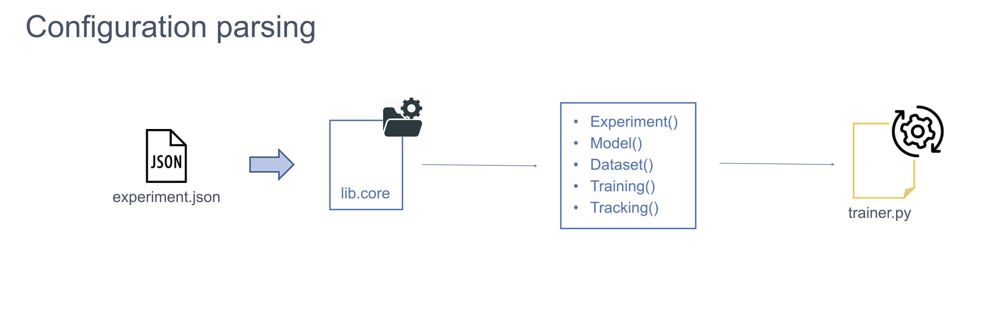
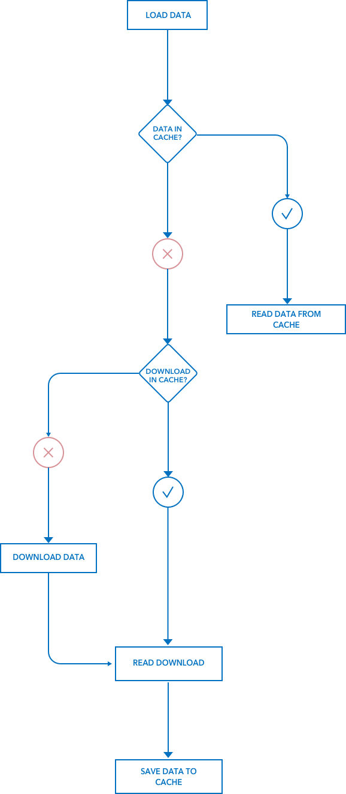

######################
Architecture
######################

***********************
System Configuration
***********************
Gymnos runs in a single process ``gymnosd.py``. This process is responsible for:

* Setting up logging and caching facilities
* Handling argument parsing
* Owning the trainer instance
* Splitting experiment configurations into relevant pieces and deliver them to the trainer instance
* Saving relevant information (such as logs and the original configuration) after training executions

Apart from that, there two important files holding the system settings:

* ``cache.json`` : paths about where to locate caching facilities 
* ``logging.json``: settings for logging facility

.. image:: ../images/gymnos-system-config.png
   :width: 600

Configuration parsing is carried out by the ``core`` library. This library takes sections from
the experiment in json format and provides a specialized object where configuration parameters are
available as class attributes (a similar approach to an ORM) 

***********************
Training
***********************
The training phase is fully controlled by ``trainer.py``. 
The ``Trainer()`` class is responsible for orchestrating any aspect related to the training such as:

- To prepare the system for the training process:

   * To create directories to store training executions
   * To collect a suitable dataset for the experiment purpose via ``Dataset()`` class
   * To load an optimized version of the requested model via ``Model()`` class
- To accomodate the selected dataset to the target model:

   * To split data for training and test
   * To apply preprocessors
- To run and monitor the training phase via ``train`` method:

   * To fit the model with the right samples
   * To perform model evaluation once th training is over
   * To save the model for future predictions
- To generate relevant artifacts for tracking and benchmarking via ``Tracking()`` class

.. image:: ../images/gymnos-training.png
    :width: 600

***********************
Datasets
***********************
Datasets are usually consumed in different ways according to experiment requirements. 
This part of the system intends to visualize a dataset as a configurable object.
Typical tasks such as:

* dataset collection
* file storage 
* data preprocessing
* ...

will be handled by the ``Dataset()`` class in first place and the corresponding dataset
specialization via the ``lib.core.dataset`` library.  

