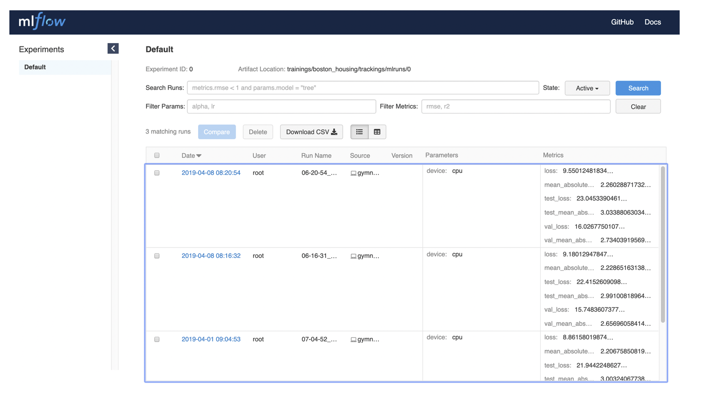
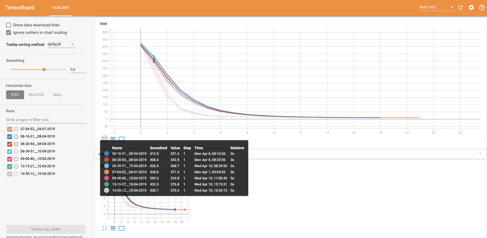
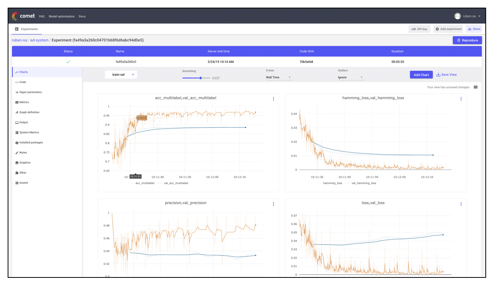

######################
Tracking
######################
Gymnos also generates a common folder structure to keep tracking of training executions.
In particular, the following artifacts are provided:

.. code-block:: bash
   :emphasize-lines: 2,28

    trainings/boston_housing/trackings
    ├── mlruns
    │   └── 0
    │       ├── 1bb61b2d9ed24b7ba55a212ed43efd9c
    │       │   ├── artifacts
    │       │   ├── meta.yaml
    │       │   ├── metrics
    │       │   │   ├── loss
    │       │   │   └── mean_absolute_error
    │       │   ├── params
    │       │   │   └── device
    │       │   └── tags
    │       │       ├── mlflow.runName
    │       │       ├── mlflow.source.name
    │       │       └── mlflow.source.type
    │       ├── 1e5aa85b2ef14790a2642996ba85a388
    │       │   ├── artifacts
    │       │   ├── meta.yaml
    │       │   ├── metrics
    │       │   │   ├── loss
    │       │   │   └── mean_absolute_error
    │       │   ├── params
    │       │   │   └── device
    │       │   └── tags
    │       │       ├── mlflow.runName
    │       │       ├── mlflow.source.name
    │       │       └── mlflow.source.type
    └── tensorboard
        ├── 06-16-31__08-04-2019
        │   └── events.out.tfevents.1554704196.8471f4b95b34
        ├── 06-20-54__08-04-2019
        │   └── events.out.tfevents.1554704456.70b7e3d20cab
        └── 14-55-12__10-04-2019
            └── events.out.tfevents.1554908115.fb70bee9ad9c

***********************
Multi-Tracking support
***********************
Gymnos supports most popular trackers currently offered these days by the industry: 

=======================
MLFlow
=======================
The `MLflow Tracking <https://www.mlflow.org/docs/latest/tracking.html>`_ component is an API and UI for logging parameters, code versions, metrics, and output files when running your machine learning code and for later visualizing the results. 
MLflow Tracking lets you log and query experiments using Python, REST, R API, and Java API APIs.
MLflow Tracking is organized around the concept of runs, which are executions of some piece of data science code.

Once the execution has finished you just need `to install MLFlow <https://www.mlflow.org/docs/latest/quickstart.html>`_ and run the following command 
pointing to your ``<experiment>/tracking/mlruns`` directory:

.. code-block:: bash

    mlflow server --backend-store-uri trainings/boston_housing/trackings/mlruns

The following image shows an example extracted from the ``Boston Housing`` experiment:

=======================
Tensorboard
=======================
To make it easier to understand, debug, and optimize TensorFlow programs, a suite of visualization tools 
called `TensorBoard <https://www.tensorflow.org/guide/summaries_and_tensorboard>`_ is included by Google to complete the TensorFlow suite . 
TensorBoard is oftenly used to visualize a TensorFlow graph, plot quantitative metrics about the execution of your graph, 
and show additional data like images that pass through it.

Once the execution has finished you just need `to install Tensorboard <https://www.tensorflow.org/install/>`_ and run the following command 
pointing to your ``<experiment>/tracking/tensorboard`` directory:

.. code-block:: bash

    tensorboard --logdir trainings/boston_housing/trackings/tensorboard/

The following image shows an example extracted from the ``Boston Housing`` experiment:

=======================
CometML
=======================
`CometML <https://www.comet.ml/>`_ lets you track code, experiments, and results on ML projects. 
It’s fast, simple, and free for open source projects. 

.. note::
    
    The project will be visible at https://www.comet.ml/<user_name>/<project_name

The following image shows an example extracted from the ``MTE`` experiment:

