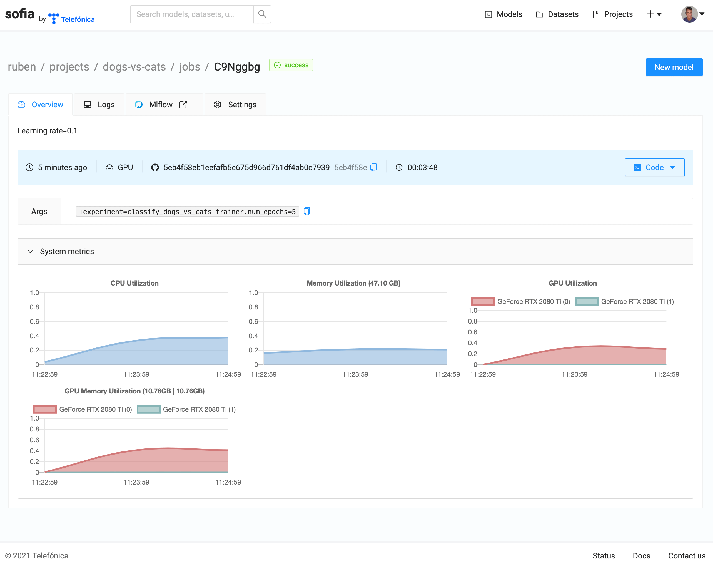

Quick Start
===========

Gymnos has a collection of datasets and models to train and predict. It uses the `Hydra <https://hydra.cc>`_ framework to manage configuration for all of its trainings and MLFlow to track metrics and parameters.
It's extremely recommended to read the `Hydra documentation <https://hydra.cc/docs/intro>`_ and the `MLFlow documentation <https://www.mlflow.org/docs/latest/index.html>`_ before.

.. contents:: :local:
    :depth: 3

Using Gymnos
****************************
In this section:
    - We will train a model for image classification,
    - We will predict an image with the trained model
    - We will upload the trained model to SOFIA

Make sure you have been logged to SOFIA. This will only be needed the first time.

.. code-block:: console

    $ gymnos-login

Model dependencies
-----------------------------

Each model will have their own dependencies, we will use the model :ref:`vision.image_classification.transfer_efficientnet` so we need to install the ``vision.image_classification.transfer_efficientnet`` extra dependency.

.. code-block:: console

    $ pip install gymnos[vision.image_classification.transfer_efficientnet]

Training
-----------
First of all, we will train the model :ref:`vision.image_classification.transfer_efficientnet` with the dataset :ref:`dogs_vs_cats` to classify dogs and cats images.

We will use the command ``gymnos-train`` to do the training.

.. code-block:: console

    $ gymnos-train dataset=dogs_vs_cats trainer=vision.image_classification.transfer_efficientnet trainer.classes="[dog,cat]" trainer.num_epochs=1

Let's split the command:

    - ``dataset=dogs_vs_cats``: we define the Gymnos dataset to use
    - ``trainer=vision.image_classification.transfer_efficientnet``: we define the Gymnos trainer to use
    - ``trainer.classes``: we customize the trainer parameter ``classes``, refer to model :ref:`vision.image_classification.transfer_efficientnet` documentation for full list of parameters
    - ``trainer.num_epochs``: we customize the trainer parameter ``num_epochs`` to ``1`` to speed-up training

While training, open MLFlow to visualize live metrics:

.. code-block:: console

    $ mlflow ui

Predicting
-------------

Once training has finished, we will use the trained model to predict whether an image contains a dog or a cat.

First of all, retrieve the Mlflow run ID from the training, either from the Mlflow dashboard or the training logs.

Now we can predict an image using the trained model. Check the model :ref:`vision.image_classification.transfer_efficientnet__predictor` to read the documentation about ``predict`` method.
Each model will have their own parameters so make sure to check the documentation for each model.

.. code-block:: python

    from gymnos.vision.image_classification.transfer_efficientnet import TransferEfficientNetPredictor

    predictor = TransferEfficientNetPredictor.from_pretrained(<MLFLOW_RUN_ID>)

    predictions = predictor.predict(<IMG_PATH>)

Uploading trained model
------------------------

Finally, we will upload the trained model to SOFIA platform.

We will only need the Mlflow run ID from the training to upload the model.

.. code-block:: console

    $ gymnos-upload <MLFLOW_RUN_ID>

Using Gymnos with SOFIA
****************************

In this section:
    - We will train a model for image classification using SOFIA platform
    - We will create a SOFIA model from the training
    - We will predict an image using the created model

Make sure you have been logged to SOFIA. This will only be needed the first time.

.. code-block:: console

    $ gymnos-login

Training
-----------

We will use the command ``gymnos-train`` to do the training.

We will also introduce the concept of experiment.
An experiment is simply a YAML file that specifies the trainer and dataset, each one with their parameters.
This is useful to avoid writing long commands and to have reproducible results.

We will also introduce the concept of multirun that enable us to train with multiple configurations. Refer to `Hydra Multi-Run <https://hydra.cc/docs/next/tutorials/basic/running_your_app/multi-run/>`_ for more information.

.. code-block:: console

    $ gymnos-train -m hydra/launcher=sofia hydra.launcher.project_name=<SOFIA_PROJECT_NAME> hydra.launcher.device=GPU +experiment=classify_dogs_vs_cats trainer.num_epochs=5,10 trainer.num_workers=-1

Let's split the command:

    - ``-m``: this flag specifies we want to use multirun. Mandatory if we specify a ``hydra/launcher``.
    - ``hydra/launcher``: we define ``sofia`` as the launcher for our training.
    - ``hydra.launcher.project_name``: we define the SOFIA project name for our training. More information about parameters for SOFIA launcher at :ref:`sofia_launcher`.
    - ``hydra.launcher.device``: we want to use GPU for our training. We can also use ``CPU`` as the device
    - ``+experiment``: we define the experiment to use. The experiment will define both the training and dataset. The plus (``+``) symbol at the beginning is mandatory. More information about experiment at :ref:`classify_dogs_vs_cats_experiment`.
    - ``trainer.num_epochs``: we override the default value for trainer parameter ``num_epochs`` with two values. This will create two trainings on SOFIA, one training where ``num_epochs`` is equal to ``5`` and one training where ``num_epochs`` is ``10``.
    - ``trainer.num_workers``: we override the default value for trainer parameter ``num_workers`` to use all CPUs while loading the dataset.

The trainining logs will have the link to the SOFIA job for each training.

Here we can visualize system metrics, logs and live metrics with MLFlow.

Creating model
----------------

Once training has finished, we can create a model. Click on `New model` button at the top right of the screen.

.. image:: _static/images/sofia_new_model.png
    :width: 100%

Once form has been submitted, a model will be created.

Predicting
-------------

We will use the created model to predict whether an image contains a dog or a cat.

First, we need to install dependencies for the model:

.. code-block:: console

    $ pip install gymnos[vision.image_classification.transfer_efficientnet]

Check the model :ref:`vision.image_classification.transfer_efficientnet__predictor` to read the documentation about ``predict`` method.
Predicting will be the same as before but instead of passing the MLFlow run ID as parameter for ``from_pretrained`` method, we will pass the SOFIA model (`<USERNAME>/models/<MODEL_NAME>`).

.. code-block:: python

    from gymnos.vision.image_classification.transfer_efficientnet import TransferEfficientNetPredictor

    predictor = TransferEfficientNetPredictor.from_pretrained(<USERNAME>/models/<MODEL_NAME>)

    predictions = predictor.predict(<IMG_PATH>)
