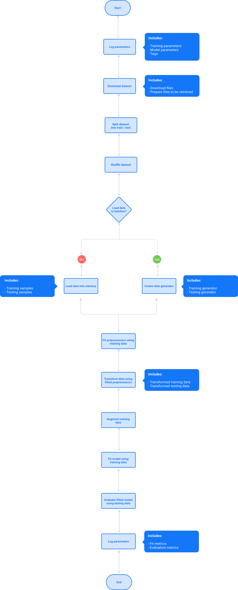
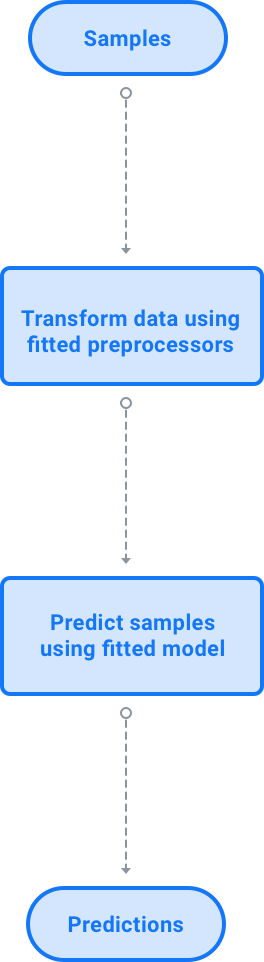
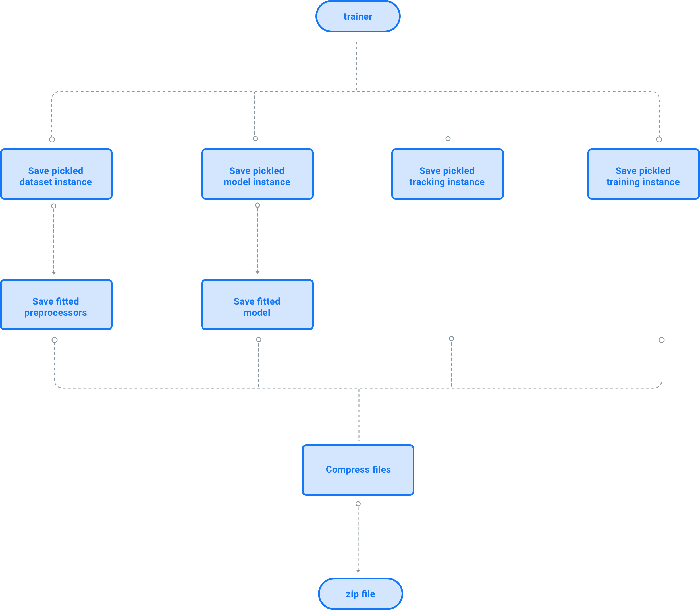
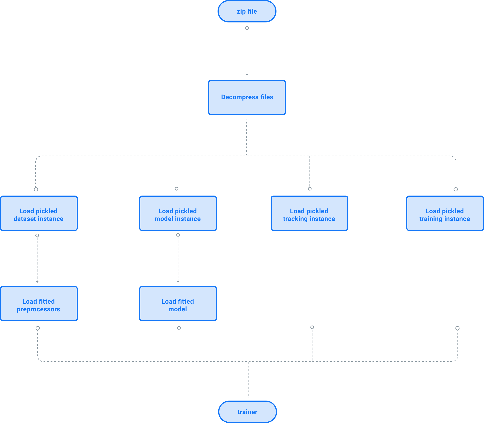

######################
Trainer
######################

This module brings the other components (datasets, models, preprocessors, data augmentors and trackers) together to form a complete system of supervised learning.

Components
============

Each instance of the Trainer is made up of 3 basic components that define each part of the Machine Learning system:

- Dataset
- Model
- Tracking

.. code-block:: python

    trainer = gymnos.trainer.Trainer(
        dataset=dataset,
        model=model,
        tracking=tracking
    )

Dataset
---------
It defines the parameters related to the dataset, i.e. dataset name, number of samples for training and testing, preprocessors, data augmentors, etc ...

For example:

.. code-block:: python

    from gymnos.core.dataset import Dataset

    dataset = Dataset(
        dataset={
            "type": "dogs_vs_cats"
        },
        samples={
            "train": 0.8,
            "test": 0.2
        },
        preprocessors=[
            {
                "type": "image_resize",
                "width": 100,
                "height": 100
            }
        ],
        data_augmentors=[
            {
                "type": "random_color",
                "probability": 0.4,
                "min_factor": 0.2,
                "max_factor": 0.7
            }
        ],
        shuffle=True,
        one_hot=True
    )

See :class:`gymnos.core.dataset.Dataset` for more details.

Model
--------

It defines the supervised learning model, its parameters and their training.

For example:

.. code-block:: python

    from gymnos.core.model import Model

    model = Model(
        model={
            "type": "dogs_vs_cats_cnn",
            "input_shape": [100, 100, 3]
        },
        training={
            "epochs": 10,
            "batch_size": 32
        }
    )

See :class:`gymnos.core.model.Model` for more details.

Tracking
------------

It defines the trackers and the parameters to be logged.

For example:

.. code-block:: python

    from gymnos.core.tracking import Tracking

    tracking = Tracking(
        log_model_params=True,
        log_training_params=False,
        trackers=[
            {
                "type": "mlflow"
            },
            {
                "type": "tensorboard"
            }
        ]
    )

See :class:`gymnos.core.tracking.Tracking` for more details.

Train
===========
Once we have defined our trainer, just call ``train`` method to start training:

.. code-block:: python

    trainer.train()

See :meth:`gymnos.trainer.Trainer.train` for more details.

Below we can see a flow diagram for the actions that will be performed when this method is called.

The return value will be a dictionnary with the following keys:

    - ``"elapsed"``: dictionnary with elapsed times for each step
    - ``"metrics"``: dictionnary with metrics from model training and model evaluation
    - ``"hardware_info"``: dictionnary with information about your hardware like cpu, gpus or platform

Callbacks
----------

A callback is a set of functions that will be applied when a certain stage of training has been completed. Each method will be called at each stage of training.
Look at the abstract class :class:`gymnos.callbacks.Callback` to see the methods you can overwrite.
To use these callbacks, pass a list of callbacks to the ``train`` method of your Trainer instance.

.. code-block:: python

    trainer.train(callbacks=[Callback1(), Callback2()])

Predict
============

Once we have trainer our Trainer instance, call the ``predict`` method with the samples to predict.

.. code-block:: python

    predictions = trainer.predict(X)

See :meth:`gymnos.trainer.Trainer.predict` for more details.

If the model is probabilistic, you can get probabilities for each class by calling the ``predict_proba`` method, passing as argument the samples to predict:

.. code-block:: python

    proba = trainer.predict_proba(X)

See :meth:`gymnos.trainer.Trainer.predict_proba` for more details.

The following flow diagram represents the steps executed when you call :meth:`predict <gymnos.trainer.Trainer.predict>` method:

Save
=======

To save our already trained Trainer instance, call the ``save`` method with the path where you want to save that file.

.. code-block:: python

    trainer.save("saved_trainer.zip")

See :func:`gymnos.trainer.Trainer.save` for more details.

The following flow diagram represents the steps executed when you call :func:`save <gymnos.trainer.Trainer.save>` method:

Load
==========

To restore a Trainer instance we have previously saved, call the ``load`` class method:

.. code-block:: python

    trainer = Trainer.load("saved_trainer.zip")

See :meth:`gymnos.trainer.Trainer.load` for more details.

The following flow diagram represents the steps executed when you call :meth:`load <gymnos.trainer.Trainer.load>` method:

