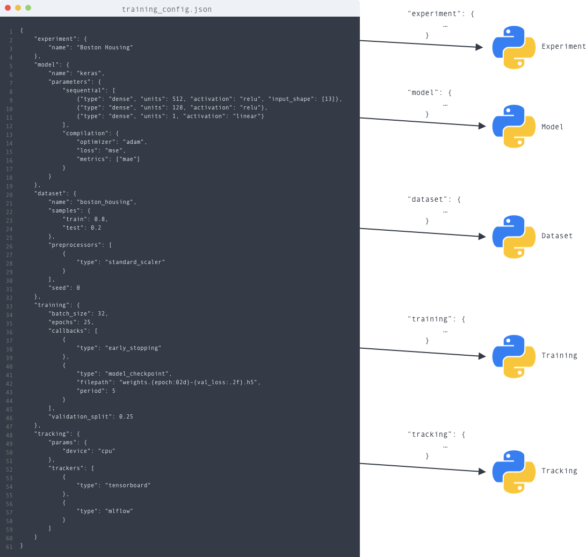

###############################
Training Configuration
###############################

.. _training_configuration:

Gymnos allows you to configure and train powerful models without writing a single line of code, only using a JSON file with the configuration of the experiment.

To run an experiment, the following keys are available:

    - ``"dataset"``: defines the dataset with the associated preprocessing
    - ``"model"``:  defines the model
    - ``"training"``: defines training parameters
    - ``"tracking"``: defines trackers to log parameters / metrics

Each key is associated with a Python instance that builds the Python objects from the JSON value (e.g build model from name, build dataset from name, build trackers, ...).

Dataset
==========
.. autoclass:: gymnos.core.dataset.Dataset

Model
==========
.. autoclass:: gymnos.core.model.Model

Training
========
.. autoclass:: gymnos.core.training.Training

Tracking
========
.. autoclass:: gymnos.core.tracking.Tracking
